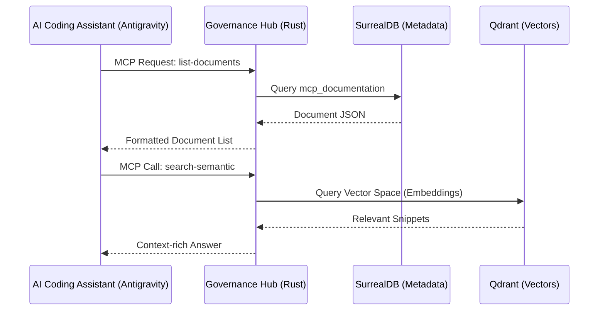

# Project Governance Report: kyx-governance (AltexSoft Standard)

> Generated at: 2026-01-05T02:15:24.172252385Z

---

## 📄 Documentation

### 1. [Product] PRD: Governance Hub

# Governance Hub Product Requirement Document (PRD)

## 🎯 Objective

To provide a centralized, high-fidelity "Registry of Truth" for the Kyx Ecosystem. The Governance Hub manages project identities, SDLC documentation, AI intelligence tools, and audit logs to ensure total ecosystem observability.

## 💎 Core Capabilities (The "What")

### 1. Project Registry & Management

- Single source of truth for all project metadata (Tech stack, team, repository).
- Standards enforcement (Linking projects to global governance rules).

### 2. High-Fidelity Knowledge Base

- Persistence of "Developer-Ready" documentation.
- Versioned (state-based) records of system design, PRDs, and TDDs.

### 3. AI Semantic Intelligence (MCP)

- Standard Model Context Protocol (MCP) server for AI-driven orchestration.
- Semantic search across all documentation using Vector Embeddings (Qdrant).

### 4. Incident & Compliance Tracking

- Formal recording of system incidents, symptoms, and resolutions.
- Real-time audit logging of AI tool usage for security compliance.

## 📈 Success Metrics

- 100% documentation coverage for all mission-critical projects.
- < 1s latency for semantic retrieval of documentation.
- Zero "un-audited" tool calls in production environments.

---

### 2. [Product] SAD: Software Architecture

# Governance Software Architecture Document (SAD)

## ⚡ Engine: Rust + Ntex + SurrealDB

The Governance Hub is built on a high-concurrency Rust engine that acts as an MCP Proxy between AI assistants and the ecosystem's metadata repository.

## 🕸️ Interaction Life-Cycle (AI Visualization)



## 📦 Major Architectual Blocks

| Block              | Responsibility                                               |
| ------------------ | ------------------------------------------------------------ |
| **MCP Dispatcher** | Handles JSON-RPC protocol, tool routing, and authentication. |
| **Logic Engine**   | Evaluates static Rust logic and dynamic SQL templates.       |
| **Search Proxy**   | Interfaces with Qdrant for vector-based semantic retrieval.  |
| **Persistence**    | Manages multi-model data in SurrealDB.                       |

---

### 3. [Product] TDD: Technical Design

# Governance Technical Design Document (TDD)

## 🛠️ Low-Level Technical Specs

### 1. McpHandler Interaction Logic

The `McpHandler` is the core trait implementation for all AI interactions.

```rust
pub async fn handle_tools_call(
    &self,
    request: JsonRpcRequest
) -> Result<JsonRpcResponse> {
    // 1. Identify tool execution type (static vs dynamic_sql)
    // 2. Map JSON arguments to SQL variables
    // 3. Execute and serialize result
    // 4. Record Audit Log (Non-blocking)
}
```

### 🧠 Capability & Implementation Map

| Business Capability       | Implementation Detail                                     | Repository/Module     |
| ------------------------- | --------------------------------------------------------- | --------------------- |
| **Semantic Intelligence** | OpenAI `text-embedding-3-small` -> Qdrant.                | `core/mcp/handler.rs` |
| **Audit Logging**         | Async non-blocking write to `mcp_audit_log`.              | `core/mcp/handler.rs` |
| **Dynamic Tools**         | SQL templates stored in `mcp_tools` evaluated at runtime. | `mcp_tools` table     |

## 🧬 Core Data Structures

```rust
pub struct Project {
    pub id: String,
    pub name: String,
    pub stack: ProjectStack,
    pub configs: Value,
}
```

## 🛡️ Security Implementation

- **Stateless MCP**: No session keys stored in the Hub; rely on transport-layer security.
- **Audit Consistency**: Every destructive call (`update-document`, `report-incident`) MUST be logged before returning success.

---

### 4. [Product] API & Schema

# Governance Data Schema (Deep Technical)

Detailed dictionary of the `kyx/governance` database tables.

---

## 1. `mcp_projects` (Project Identity)

| Field     | Type                   | Description                                                    |
| --------- | ---------------------- | -------------------------------------------------------------- |
| `id`      | `record(mcp_projects)` | Unique identifier.                                             |
| `name`    | `string`               | Unique slug (e.g., `kyx-kernel`).                              |
| `stack`   | `object`               | `{ languages: string[], framework: string, runtime: string }`. |
| `configs` | `object`               | Dynamic project-specific metadata.                             |

## 2. `mcp_documentation` (Knowledge Base)

| Field        | Type                   | Description                                            |
| ------------ | ---------------------- | ------------------------------------------------------ |
| `project`    | `record(mcp_projects)` | Link to target project.                                |
| `sdlc_phase` | `string`               | `planning`, `design`, `implementation`, `maintenance`. |
| `name`       | `string`               | Machine name (e.g., `ops-manual`).                     |
| `title`      | `string`               | Display title.                                         |
| `content`    | `string`               | The technical Markdown record.                         |

---

## ⚖️ Governance Rules

| Priority | Type   | Content                                                                |
| -------- | ------ | ---------------------------------------------------------------------- |
| 94       | global | Rule: High-Fidelity & AI-Optimized Documentation (AltexSoft Standard). |

Priority: 94 (MANDATORY)

Documentation MUST be systematic, precise, and optimized for both human clarity and AI technical comprehension.

## 1. Product Documentation Structure (The "What" and "How")

Every functional area MUST include:

- **PRD (Product Requirements)**: Defines high-level features, business value, and "What" it does.
- **SAD (Software Architecture Document)**: Defines the high-level system structure. MANDATORY: Use Mermaid diagrams to visualize logic flows and component interactions for AI visibility.
- **TDD (Technical Design Document)**: Bridges Architecture and Code. MUST include exact function signatures, data structures, and "Capability & Implementation Maps".

## 2. API & Integration

- Reference-level documentation for all interfaces (REST, WebSocket, MCP).
- Include request/response payloads, authentication flows, and error handling codes.

## 3. Ops & Maintenance (System Admin)

- "Ops Manual" detailing deployment steps, configuration environment variables, and troubleshooting guides (Incident patterns).

## 4. Process Documentation

- **Implementation Summary**: Chronicling phase results.
- **Work Log**: Detailed record of "Who, When, and What was changed".

## 5. Visual AI Intelligence

- All complex logic flows (Auth handshakes, Database write-paths) MUST be expressed via Mermaid diagrams.
- Images and recordings MUST be descriptive for AI reference. |

## 🛡️ Incident Logs

(Empty)
