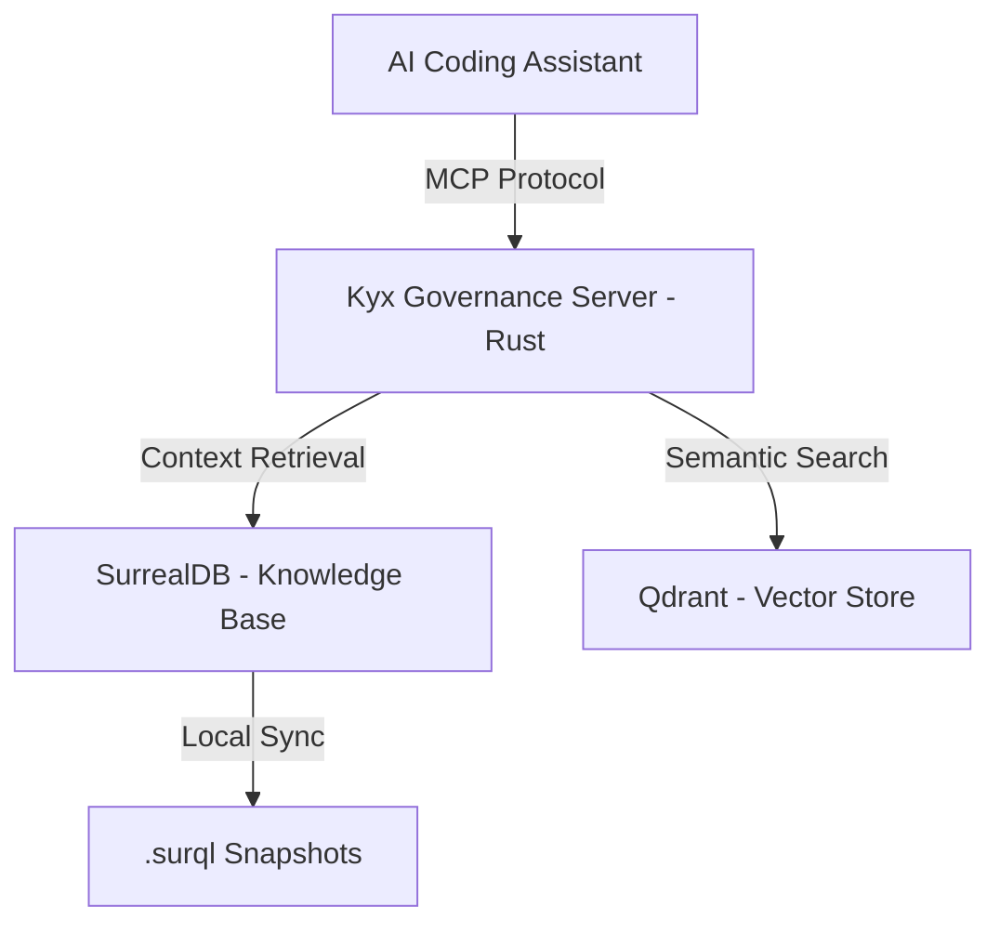

# PROJECT_OVERVIEW: kyx-governance

project_id: kyx-governance
author: Antigravity
created_by: ai
ai_prompt: "Establishing the source of authority overview"
ai_confidence: 0.99
last_updated: 2026-01-05

## 📌 1. What is this project?

kyx-governance คือ "สมองส่วนกลาง" ของ Kyx Ecosystem ทำหน้าที่เก็บรวบรวมกฎระเบียบ (Rules), มาตรฐาน (Standards) และเอกสารการออกแบบ (SDLC Documents) ทั้งหมด เป็นแหล่งอ้างอิงเดียวที่ทำให้ AI และคนทำงานสอดคล้องกัน

## 📌 2. Why does this project exist?

เราพบว่าปัญหาใหญ่ที่สุดในการพัฒนาโปรเจกต์ขนาดใหญ่คือ "AI Context Drift" (AI เข้าใจระบบผิดเพี้ยนไปตามกาลเวลา) เราจึงสร้าง Hub นี้ขึ้นเพื่อ:

- บังคับใช้มาตรฐานการพัฒนาเป็น Executable Rules
- ป้องกันความซ้ำซ้อนของการออกแบบ
- สร้าง Traceability จากจุดเริ่มต้นของไอเดียไปจนถึง Code จริง

## 📌 3. What can this system do? (Capabilities)

- จัดการ Governance Rules (Global & Project-specific)
- เป็น Hub สำหรับ SDLC Documentation (PRD, SAD, TDD, Overview)
- จัดการ Incident Reports และแก้ปัญหาอย่างเป็นระบบ
- ทำความเข้าใจบริบทผ่าน AI-powered Semantic Search (Qdrant + OpenAI)
- Sync สถานะความรู้ระหว่าง Database และ Local Filesystem

## 📌 4. What does it NOT try to do? (Non-Goals)

- **ไม่ใช่ Code Repository:** ไม่ได้เก็บ Source Code ของระบบอื่น แต่เก็บ Metadata และ Rules
- **ไม่ใช่ CI/CD Server:** แต่เป็นที่เก็บกติกาที่ CI/CD จะต้องนำไปตรวจสอบ (Linter Rules)

## 📌 5. High-level Architecture (System Narrative)

kyx-governance ทำงานในรูปแบบ MCP (Model Context Protocol) Server เพื่อเป็นช่องทางให้ AI Agent เข้าถึงฐานความรู้ใน SurrealDB ได้โดยตรง

## 📌 6. How did we get here? (Evolution)

- **Phase 1: Static Rules**: เริ่มต้นด้วยไฟล์ Markdown ธรรมดาที่ AI มักจะมองข้าม
- **Phase 2: Governance Hub (MCP)**: เปลี่ยนมาใช้ MCP Server เพื่อให้ AI "ถูกบังคับ" ให้อ่านกฎก่อนทำงาน
- **Phase 3: Execution-Grade vFinal**: เพิ่มความเข้มงวดของ Traceability และลบความคลุมเครือทั้งหมดออก

## 📌 7. Key Design Decisions (The "Why")

### Why MCP?

- เป็นมาตรฐานเดียวที่ AI เอเจนท์สมัยใหม่ (เช่น Antigravity) เข้าใจและใช้งานได้เสถียรที่สุด

### Why SurrealDB?

- รองรับการทำ Graph-like relationships ระหว่างกฎ, เอกสาร และโปรเจกต์ ซึ่งสำคัญมากต่อการทำ Traceability

## 📌 8. How this project fits in the Kyx Ecosystem

ทุกโปรเจกต์ใน Kyx ต้องเชื่อมต่อกับ kyx-governance ก่อนเริ่มงาน (Rule 0-11) เพื่อรับบริบทที่ถูกต้อง

## 📌 9. Where to go next? (Entry Points)

- ระบบจัดการกฎ → [PRD.md]
- การออกแบบ MCP → [SAD.md]
- รายละเอียดกฎ 21 ข้อ → [GOVERNANCE.md]
