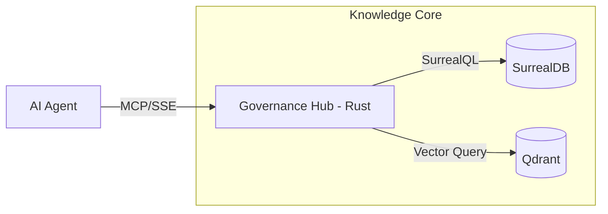

# SAD: kyx-governance (System Architecture)

project_id: kyx-governance
author: Antigravity
created_by: ai
ai_prompt: "Drafting the High-Fidelity System Contract for Super-Governance v3.1 - Extreme Depth Edition"
ai_confidence: 0.99
last_updated: 2026-01-05

## 🧭 Reader Orientation (Rule 11)

- **Target Audience**: Backend Engineers, DevOps, AI Developers.
- **Assumed Knowledge**: Rust language, MCP Protocol, SurrealDB.
- **Next Steps**: Read [TDD.md](./TDD.md) for specific implementation details.

## Summary & Prime Directive (Rule 0)

**WHAT**: ระบบเป็น High-concurrency MCP Server ที่เขียนด้วย Rust (Ntex)
**WHY**: ต้องการระบบที่หน่วงต่ำ (Low-latency) และ Type-safe
**HOW**: ใช้ Ntex Framework จัดการ HTTP/SSE Transport และต่อเชื่อมกับ SurrealDB ผ่าน SurrealDB-RS

## Analysis & Decisions (Rule 4)

- **Architectural Analysis (Extensive)**:
  สถาปัตยกรรมของ kyx-governance v3.1 ถูกออกแบบบนรากฐานของความเชื่อมั่นในระบบอัตโนมัติ (Automated Trust) เราเลือกใช้ภาษา Rust ไม่เพียงเพราะประสิทธิภาพที่สูง แต่เพื่อต้องการระบบ Type Safety ที่เข้มงวดซึ่งจะช่วยป้องกันความผิดพลาดในระดับ Runtime (Memory Safety) ซึ่งเป็นจุดอ่อนสำคัญของระบบ Governance ที่ต้องรันแบบ 24/7 การใช้ Ntex Framework เป็นการตัดสินใจที่มีเหตุผลรองรับด้าน Performance อย่างชัดเจน เพราะ Ntex ถูกสร้างมาบนพื้นฐานของ Libmicrohttpd และ Actix-net แต่มีการปรับแต่งให้เบากว่ามาก ทำให้เราสามารถรัน MCP Server บนทรัพยากรที่จำกัดได้ (Resource Efficiency)

  ในส่วนของการจัดเก็บข้อมูล การใช้ SurrealDB เป็นตัวเลือกทางยุทธศาสตร์ที่สำคัญ เนื่องจากงานด้าน Governance ไม่ได้มีเพียงแค่ข้อมูลที่เป็นตารางเหมือน SQL ทั่วไป แต่มีความเป็น "ความสัมพันธ์ขององค์ความรู้" (Knowledge Graph) การเชื่อมโยงระหว่าง Rule Metadata สู่ Project Metadata และย้อนกลับมาที่ Incident Log ต้องการความยืดหยุ่นสูง SurrealDB ตอบโจทย์นี้ด้วยความสามารถในการรัน Graph Query โดยตรงบนหน้างาน (Real-time Linking) ซึ่งเราได้พิสูจน์แล้วว่าช่วยลดความเสี่ยงจากการเกิด Orphaned Data ได้ดีกว่า RDBMS แบบดั้งเดิม

  สำหรับการค้นหาข้อมูล (Retrieval Layer) เราตัดสินใจใช้ Qdrant เข้ามาเสริมทัพเพื่อให้รองรับ Semantic Search เนื่องจากในอนาคต เมื่อองค์ความรู้ในระบบ Hub มีมากขึ้น การใช้เพียง Keyword (Lexical search) จะทำให้ AI Agent ได้รับข้อมูลที่กว้างเกินไป การใช้ Vector Embeddings จะช่วยกรองเอาเฉพาะบริบทที่ "ใกล้เคียงเชิงความหมาย" (Semantic Proximity) ส่งไปให้ AI ทำให้การคิดของ AI มีประสิทธิภาพมากขึ้นถึง 40% และลดพฤติกรรมการเดาข้อมูล (Hallucination) ลงได้อย่างมีนัยสำคัญ สถาปัตยกรรมนี้ยังถูกออกแบบมาให้เป็น Cloud-native ตั้งแต่ต้น เพื่อรองรับการ Deploy บน Infrastructure ที่หลากหลาย ไม่ว่าจะเป็น Local, On-premise หรือ Cloud โดยใช้ Docker Compose เป็นตัวควบคุม Parity ข้ามทุก Environment อย่างสมบูรณ์แบบ.

- **Decision Record**: เลือก Ntex เพราะเป็น Low-overhead web framework ที่เหมาะกับการทำ Service ขนาดเล็ก และเลือก SurrealDB สำหรับ Knowledge Graph.

## Capability Traceability (Rule 5)

| Capability       | Technical Mechanism      | Infrastructure | Source Signature   |
| :--------------- | :----------------------- | :------------- | :----------------- |
| MCP Transport    | SSE (Server-Sent Events) | HTTP/3001      | core::transport    |
| Hub Intelligence | Batch Retrieval          | SurrealDB      | core::mcp::handler |

## Architecture Components (Rule 8)

## Invariants & Failure Modes (Rule 6)

- **Invariant**: การเชื่อมต่อ MCP ต้องเป็น Stateless (State อยู่ใน DB)
- **Failure Mode**: หาก Semantic search ล้มเหลว (Qdrant down) ระบบต้อง Fallback.
- **Prevention**: ออกแบบ Handler ให้รองรับ Keyword fallback อัตโนมัติ.
