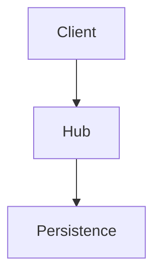

# PROJECT_OVERVIEW: <Project Name>

project_id: <project>
author: <name>
created_by: ai
ai_prompt: "KYX Canonical Overview Prompt"
ai_confidence: 0.98
last_updated: YYYY-MM-DD

## 📌 1. What is this project?

(3–5 บรรทัดสรุป: ระบบนี้คืออะไร, เป็นชิ้นส่วนไหนของ Ecosystem, ถ้าไม่มีจะเป็นอย่างไร)

## 📌 2. Why does this project exist?

(เหตุผลเชิงสถาปัตยกรรมและ Pain points ที่ระบบนี้ถูกสร้างมาเพื่อแก้)

## 📌 3. What can this system do? (Capabilities)

- Capability A
- Capability B
- Capability C

## 📌 4. What does it NOT try to do? (Non-Goals)

- ระบบนี้ไม่ใช่...
- ระบบนี้จะไม่ทำ...
- ส่วนนี้จะถูก Delegate ไปยัง...

## 📌 5. High-level Architecture (System Narrative)

(เล่าเรื่องราว Data Flow และส่วนประกอบสำคัญในระดับ Conceptual)

## 📌 6. How did we get here? (Evolution)

- **Phase 1**: ...
- **Phase 2**: ...
- **Phase 3**: ...

## 📌 7. Key Design Decisions (The "Why")

### Why [Tech/Pattern]?

- Reason 1
- Reason 2

## 📌 8. How this project fits in the Kyx Ecosystem

(ระบบนี้ถูกเรียกใช้โดยใคร และเรียกใช้ใครต่อ)

## 📌 9. Where to go next? (Entry Points)

- Product behavior → [PRD.md]
- High-level design → [SAD.md]
- Exact implementation → [TDD.md]
- Operational rules → [GOVERNANCE.md]
